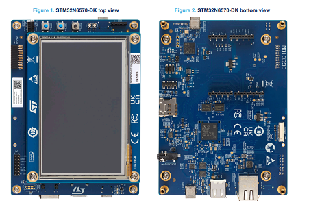
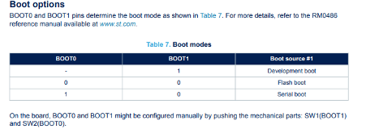

# STM32N6570-DK
## User Manual

## BOOT options
### How to run code
For normal development with STM32CubeIDE or STM32CubeProgrammer:

1. Set the board to Flash boot
    1. BOOT0 = 0
    2. BOOT1 = 0
2. Connect the board with the ST-LINK USB connector.
3. Build your project in STM32CubeIDE.
4. Click Run or Debug.
5. The ST-LINK programs the flash and starts execution. (Press RESET if needed.)
6. With BOOT0=0 and BOOT1=0, the board should boot your application from flash every reset or power cycle.


---

# LTDC Bring-Up Guide for STM32N6570-DK

## Scope

This guide shows how to bring up the **LTDC** on the **STM32N6570-DK** starting from a **new CubeMX/CubeIDE project**, without copying an existing LTDC example project.

It covers:

- which project type to create
- whether to use **FSBL** or **Appli Secure**
- recommended boot mode for debug
- `.ioc` configuration
- LCD-related GPIOs you must not forget
- framebuffer and first-test recommendations
- common failure points

---

## 1. Which project should I create?

For a **first LTDC bring-up**, create a **normal board-based application project**.

### Recommended choice
- Open **STM32CubeMX** or **STM32CubeIDE**
- Choose **Start My Project from ST Board**
- Select **STM32N6570-DK**
- Create a **standard application project**

### Do not start with FSBL
Do **not** start with **FSBL** for your first LTDC test.

**FSBL** is the **first-stage bootloader** used in the STM32N6 secure-boot flow. It is needed when the BootROM must load and execute a signed first-stage image before the application starts.

### Do not start with Appli Secure
Do **not** start with **Appli Secure** for your first LTDC test either.

**Appli Secure** is used in a secure / nonsecure isolation flow, where the secure application configures the isolation and then jumps to the nonsecure application.

### Practical recommendation
For simply getting the display working:

- create a **normal STM32N6570-DK board project**
- do **not** start with **FSBL**
- do **not** start with **Appli Secure**

Use FSBL / Appli Secure only when you are intentionally implementing the STM32N6 security chain.

---

## 2. Which boot mode should I use during debug?

For first LTDC bring-up in CubeIDE/debug, use:

- **Development boot**

On this board, the boot switches select:

- **BOOT0 = 0, BOOT1 = 1** -> **Development boot**
- **BOOT0 = 0, BOOT1 = 0** -> **Flash boot**
- **BOOT0 = 1, BOOT1 = 0** -> **Serial boot**

### Recommended during development
Use:

- **BOOT0 = 0**
- **BOOT1 = 1**

That is the safest mode for first project bring-up and debugging.

---

## 3. Bring-Up Checklist

Use this checklist before flashing and testing LTDC.

### 3.1 Project creation
- [ ] Start from **STM32N6570-DK** board
- [ ] Create a **standard application project**
- [ ] Do **not** use **FSBL** for the first LTDC bring-up
- [ ] Do **not** use **Appli Secure** for the first LTDC bring-up

### 3.2 Boot mode
- [ ] `BOOT0 = 0`
- [ ] `BOOT1 = 1`
- [ ] Board is in **Development boot**

### 3.3 LTDC basic settings
- [ ] LTDC enabled in `.ioc`
- [ ] **Active Width** = `800`
- [ ] **Active Height** = `480`
- [ ] **HSync** = `5`
- [ ] **HBP** = `8`
- [ ] **HFP** = `8`
- [ ] **VSync** = `5`
- [ ] **VBP** = `8`
- [ ] **VFP** = `8`

### 3.4 LTDC clock
- [ ] **LTDC clock source** = `IC16`
- [ ] **LTDC clock** = `25 MHz`

### 3.5 LTDC polarities
- [ ] **HSYNC polarity** = active low
- [ ] **VSYNC polarity** = active low
- [ ] **DE polarity** = active low
- [ ] **Pixel clock polarity** = `IPC`

### 3.6 Layer 0
- [ ] **Layer 0** enabled
- [ ] **Pixel format** = `RGB565`
- [ ] **Window X0** = `0`
- [ ] **Window X1** = `800`
- [ ] **Window Y0** = `0`
- [ ] **Window Y1** = `480`

### 3.7 GPIO configuration
- [ ] `PQ3` configured as `GPIO_Output`
- [ ] `PQ6` configured as `GPIO_Output`
- [ ] `PQ3` used for `LCD_ONOFF`
- [ ] `PQ6` used for `LCD_BL_CTRL`

### 3.8 LTDC signal pin mapping
- [ ] `LCD_CLK`   -> `PB13`
- [ ] `LCD_HSYNC` -> `PB14`
- [ ] `LCD_VSYNC` -> `PE11`
- [ ] `LCD_DE`    -> `PG13`

#### Red channel
- [ ] `LCD_R0` -> `PG0`
- [ ] `LCD_R1` -> `PD9`
- [ ] `LCD_R2` -> `PD15`
- [ ] `LCD_R3` -> `PB4`
- [ ] `LCD_R4` -> `PH4`
- [ ] `LCD_R5` -> `PA15`
- [ ] `LCD_R6` -> `PG11`
- [ ] `LCD_R7` -> `PD8`

#### Green channel
- [ ] `LCD_G0` -> `PG12`
- [ ] `LCD_G1` -> `PG1`
- [ ] `LCD_G2` -> `PA1`
- [ ] `LCD_G3` -> `PA0`
- [ ] `LCD_G4` -> `PB15`
- [ ] `LCD_G5` -> `PB12`
- [ ] `LCD_G6` -> `PB11`
- [ ] `LCD_G7` -> `PG8`

#### Blue channel
- [ ] `LCD_B0` -> `PG15`
- [ ] `LCD_B1` -> `PA7`
- [ ] `LCD_B2` -> `PB2`
- [ ] `LCD_B3` -> `PG6`
- [ ] `LCD_B4` -> `PH3`
- [ ] `LCD_B5` -> `PH6`
- [ ] `LCD_B6` -> `PA8`
- [ ] `LCD_B7` -> `PA2`

### 3.9 Framebuffer
- [ ] Use **one framebuffer only**
- [ ] Use **RGB565**
- [ ] Full-screen buffer size = `800 x 480 x 2 = 768000 bytes`
- [ ] `static uint16_t framebuffer[480][800];`
- [ ] Framebuffer address points to valid accessible memory
- [ ] Framebuffer is filled with a known test color before enabling LTDC

### 3.10 Initialization order
- [ ] `HAL_Init()`
- [ ] `SystemClock_Config()`
- [ ] `MX_GPIO_Init()`
- [ ] `PQ3` set high
- [ ] `PQ6` set high
- [ ] `MX_LTDC_Init()`

### 3.11 First test strategy
- [ ] Use **one layer only**
- [ ] Use **full-screen output**
- [ ] Use **solid-color test pattern**
- [ ] Do **not** start with TouchGFX
- [ ] Do **not** start with DMA2D
- [ ] Do **not** start with double buffering

### 3.12 Debug checks if screen stays black
- [ ] Confirm **Development boot** is selected
- [ ] Confirm `PQ3` is high
- [ ] Confirm `PQ6` is high
- [ ] Confirm LTDC clock is running
- [ ] Confirm framebuffer address is valid
- [ ] Confirm layer window matches screen size
- [ ] Confirm timings match the configured panel
- [ ] Check for pin conflicts on `PB4` and `PA15`

### 3.13 Expected first success
- [ ] Backlight turns on
- [ ] Panel powers on
- [ ] Solid color fills the screen
- [ ] No flicker
- [ ] No corrupted lines

## 4. Example code to turn on the screen

### In `main.c`
#### Globals
```
/* USER CODE BEGIN PV */
#define LCD_WIDTH  800
#define LCD_HEIGHT 480

static uint16_t framebuffer[LCD_HEIGHT][LCD_WIDTH];
/* USER CODE END PV */
```

```
/* USER CODE BEGIN PD */
#define RGB565_RED    0xF800
#define RGB565_GREEN  0x07E0
#define RGB565_BLUE   0x001F
#define RGB565_WHITE  0xFFFF
/* USER CODE END PD */
```

#### Functions
```
/* USER CODE BEGIN 0 */
void FillFramebuffer(uint16_t color)
{
    for (uint32_t y = 0; y < LCD_HEIGHT; y++)
    {
        for (uint32_t x = 0; x < LCD_WIDTH; x++)
        {
            framebuffer[y][x] = color;
        }
    }
}
/* USER CODE END 0 */
```
#### Modify
```
void MX_LTDC_Init(void)
{
  LTDC_LayerCfgTypeDef pLayerCfg = {0};

  extern uint16_t framebuffer[480][800];
  pLayerCfg.FBStartAdress = (uint32_t)&framebuffer[0][0];

  pLayerCfg.PixelFormat = LTDC_PIXEL_FORMAT_RGB565;

  pLayerCfg.WindowX0 = 0;
  pLayerCfg.WindowX1 = 800;
  pLayerCfg.WindowY0 = 0;
  pLayerCfg.WindowY1 = 480;

  HAL_LTDC_ConfigLayer(&hltdc, &pLayerCfg, 0);
}
```